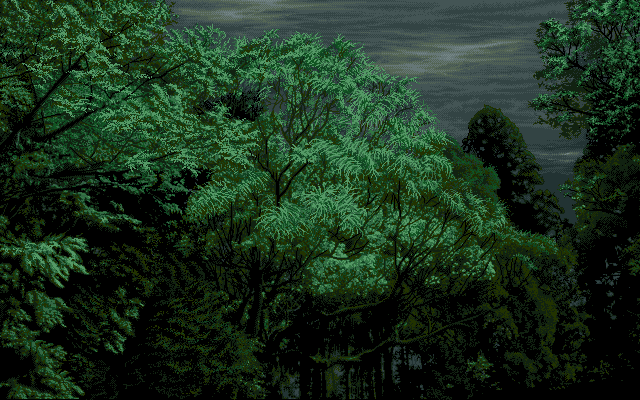
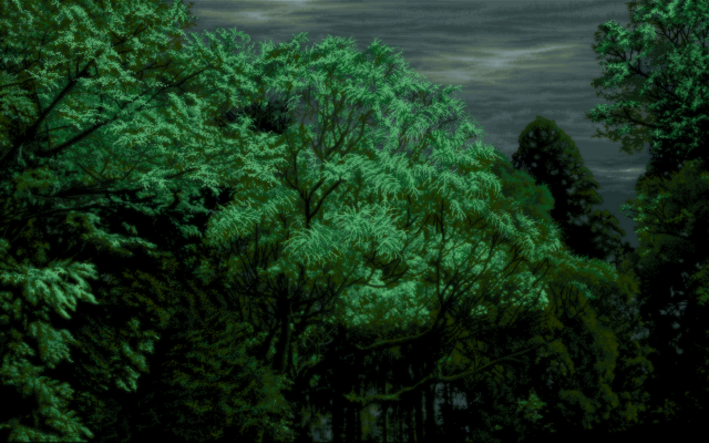
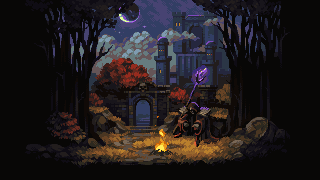
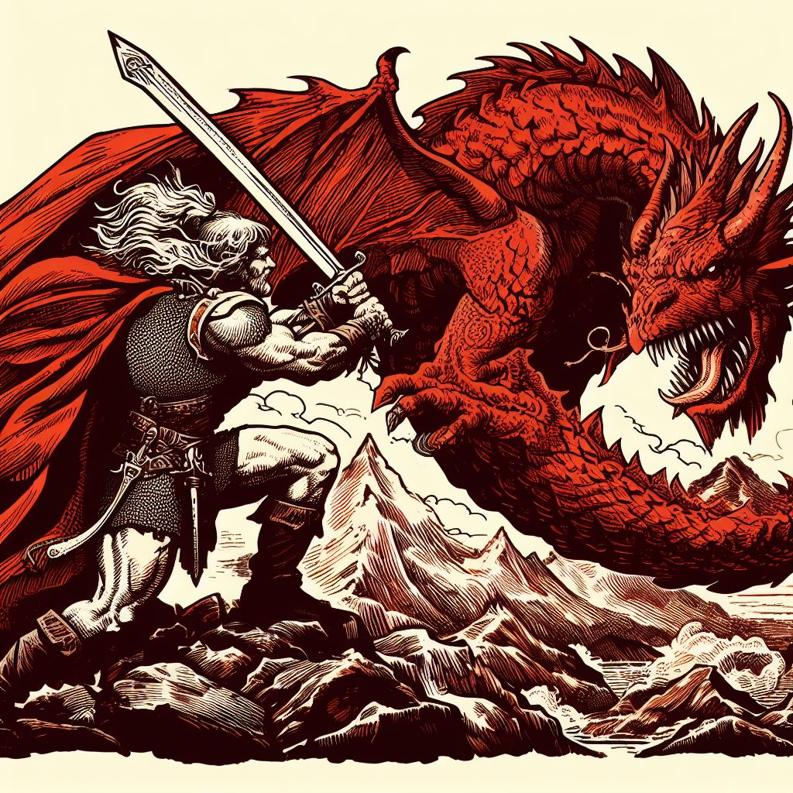
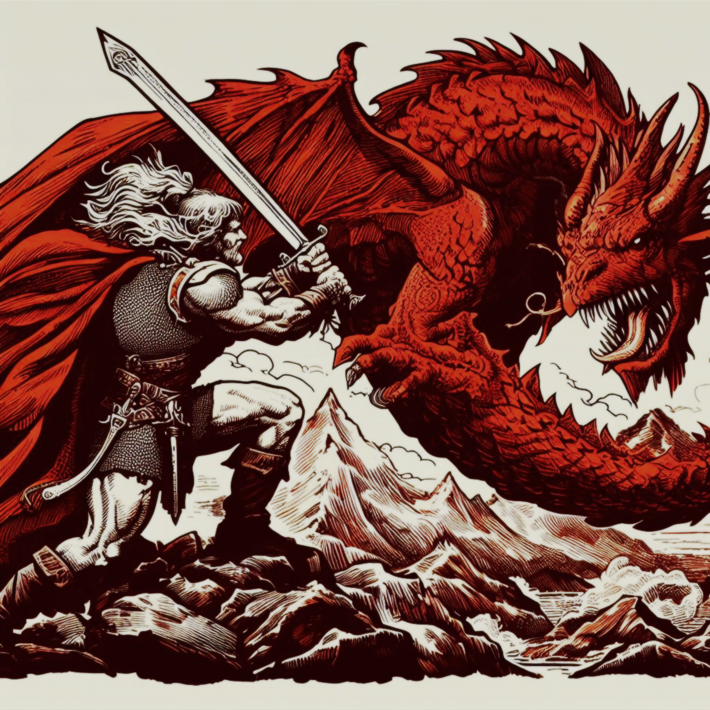

# mediaToScanline
Covert images, gif, and video to have a scanline effect

# Showcase

# Video?
Works with videos too. It works by first extracting the frames, then converting them via concurrency, spawning about 1/2 of CPU cores to process the images.
Once that is done, it uses the new av1 (requires the new nvidia gpus) and puts the video back together along with the right framerate and sound (no audio quality loss, it's not re-encoded).

If your GPU doesn't support the new av1 encoder, you can change it to use e.g. 265, or just change the quality value in the scanline.py, search for "ffmpeg" and you should find it there.

# Adjust settings?
At the very bottom of the scanline.py, you'll find the various values used. I made those based on my assumption of how a CRT might look like. It might be too blurry for some, or not blurry enough for others, so you're welcome to adjust it to fit your needs.

# General Info
This doesn't just apply a "scanline" filter among other filters, the aim of this was to add in actual scanlines inbetween the pixels, so instead of being a scanline overlay, it produces a more authentic scanline effect by inserting the lines inbetween the pixel rows for each row of pixels, creating a much better look.

It works with any resolution, at least for the ones I've tried. You can run it for 4k images, but you'll hardly see the scanline, might not be worth it, unless you're looking for a subtle effect.
Keep in mind though, it will take longer the bigger the source image is.

# Installation
pip install -r req.txt

make sure ffmpeg is installed for video stuff

then you can run something like:
python scanline.py ./tumbl.png
